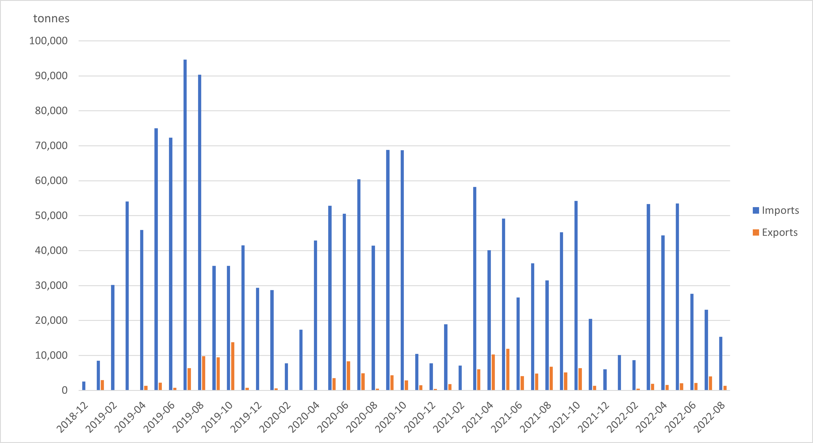

# Observed Cross-Border Mobility Traces in Lebanon and Syria

## Overview

This section introduces the use of an alternative big data source – Automatic Identification System (hereafter, AIS) – to monitor seaborn trade activity in Syrian ports. AIS was originally developed by the International Maritime Organization in 2004 to prevent collisions between large vessels. This system requires all commercial ships (gross tonnage greater than 300) and passenger ships to broadcast their position via ground stations and satellites.

A nascent literature has been dedicated to convert raw AIS messages into economic values of trade (Arslanalp et al., 2021; Cerdeiro et al., 2020; Jia et al., 2019; Verschuur et al., 2021a, 2021b). These papers utilize dynamic information on ship movements, static characteristics of each ship, and reported draft (depth of submergence), to estimate the amount of goods offloaded or loaded at a certain port. While this approach is grounded on principles from physics and has been validated with official statistics, issues with missing data make it less reliable in the context of Syria. 

For the purposes of the monitor, we implement the methodology described in “Global economic impacts of COVID-19 lockdown measures stand out in high frequency shipping data” (Verschuur et al., 2021b), using the same AIS data used by the authors, facilitated by the [UN Global Platform AIS Task Team](https://unstats.un.org/wiki/display/AIS/AIS+Handbook+Outline). We choose to follow this paper as it is the latest global AIS analysis which included Syria, and the data processing steps are described in detail in the appendix. The authors report strong correlations between predicted trade and reported trade for selected countries (0.52 - 0.96), as well as with trade flows retrieved from UN Comtrade (0.84 - 0.86). 

## Method

The method can be broken down into the following four steps. A lengthier description of each step is available on “S1 Appendix: Methodology maritime trade estimates” ​(Verschuur et al., 2021b)​.

### Step 1. Data Extraction

We retrieve all AIS messages that intersect a 20-kilometer buffer from each port in Syria (Al Ladhiqiyah, Tartus, Baniyas), available from December 1st, 2018, to August 31st, 2022. This results in a dataset of 98,662 AIS messages, the majority of which are concentrated in Al Ladhiqiyah and Tartus.

### Step 2. Data Preparation

The AIS data is sorted by MMSI (unique identified per ship) and timestamp of each record. We then run an algorithm that captures days with consecutive AIS messages and groups them into separate port calls, calculating new attributes for each trip: turnaround-time (total time spent at port between arrival and departure), difference in reported draft, and difference in direction of travel. 

Port calls that meet the following criteria are excluded to keep trips that are likely related to trade: vessel types that are not cargo or tankers, turnaround time less than five hours (refueling), greater than 95th percentile (maintenance), or less than 10 hours with a change of direction within 45 degrees (passing by). This results in a dataset of 793 port calls for Al Ladhiqiyah, and 307 for Tartus. 

### Step 3. Data Attributes

Besides vessel dimensions, there are three other key requirements to estimate the magnitude of trade: (1) the carrying capacity, or deadweight tonnage (DWT), (2) the block coefficient, or ratio of volume displacement, and (3) the difference in reported draft. 

(1) Deadweight tonnage is retrieved from the authors’ commercial vessel database. For vessels that cannot be matched to the database, a Random Forest Regressor is used to predict deadweight tonnage, using vessel dimensions as independent variables (length, width, design draft). (2) Block coefficients per vessel category are retrieved from a technical report (DHI, 2018). 

Finally, (3) difference in draught is calculated from the AIS data. Draft data is reported by the ship crews, but a difference between outgoing and incoming draft is only identified in 37% of the port calls. For the remaining trade journeys, we follow the back-propagation technique. We define outgoing draft by retrieving the incoming draft reported at the next port. We search for the next port of entry in the following 3 days. This technique filled about 60% of cases where there was no draft change reported. 

### Step 4. Trade Estimation

The payload, or utilization rate (what percentage of capacity is used to carry goods) *Uv* is calculated using the following formula:

<figcaption align = "center">
</figcaption>

Where *Cb* is the block coefficient, *dd* is the design draft, *dr* is the reported draft, *L* is the length, *W* is the width, *DWT* is the deadweight tonnage, and *Pw* is a constant for the density in salt water.

The utilization rate is multiplied by deadweight tonnage to calculate the volume of cargo being transported. The direction of the change in draught dictates whether the cargo is considered an import or an export. If the outgoing draught is greater than the incoming draught, the trade flow is considered an export, and the inverse is true for imports. 

In the majority of cases, vessels either load or unload goods. Therefore, we estimate the trade flows based on the net unloading (imports) or loading (exports) of vessels, which is estimated based on the draft differences when entering and leaving the port. In case there is no difference between the ingoing and outgoing draft (as this is not always manually entered), we estimate the ratio of unloading (fraction exports) and loading (fraction imports) based on the imbalance measured at the port. (Verschuur et al., 2021b)

## Findings

We present results of the estimated volume of trade (imports and exports) across both ports in Syria (Latakia and Tartus). Despite the relatively small number of ships captured by the AIS data in Syria (498 vessels), the data is comprehensive enough to identify general trends from the limited trade that remains since the fallout of the conflict. The trade flow is consistently dominated by imports. We find a decrease in trade volume in 2020, with slight decreases in 2021 and 2022.

<figcaption align = "center"><b>Estiamted Monthly Trade Volume from AIS signals</b>
</figcaption>

The general trends identified are consistent with the AIS-derived estimates reported by UN Comtrade, although the decrease is more pronounced in the Comtrade data. Although both estimates are based on the same AIS data, there are important methodological differences that affect the results. Key differences include the coverage of vessel information, the method to define port boundaries (Comtrade uses an automated method), and the trade estimation formula.

## Limitations

- The accuracy of the trade estimation method depends heavily on the level of draft reporting in ports, which varies globally. Most of the port calls in Syrian ports had no reported change between incoming and outgoing draft. 

- The methodology doesn’t currently account for transshipment (goods that are offloaded at a port and then loaded onto another vessel without going through customs). We have no data on transshipment rates in Syrian ports. 

- This methodology does not capture trade conducted by vessels that turn off their AIS signals. The team intends to explore this topic with further research.

## Notebooks

01 Descriptive Stats: Exploration of AIS data
02 Trade Estimation: Implementation of methodology