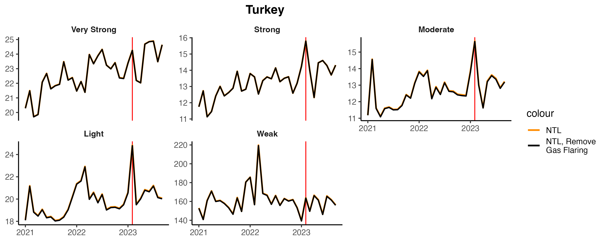

# 2023-12 Update - Nighttime Lights

We examine trends in daily nighttime lights from before and after the February 6 earthquake. 

### Monthly Trends in Nighttime Lights by Earthquake Intensity

> *Average Trends in Nighttime Lights by Earthquake Intensity. The red line indicates February, 2023.*

> *Average Trends in Nighttime Lights by Earthquake Intensity. The red line indicates February, 2023.*

> *Average Trends in Nighttime Lights by Earthquake Intensity. The red line indicates February, 2023.*

### Percent Change in Nighttime Lights

> *Average Trends in Nighttime Lights by Earthquake Intensity. The red line indicates February, 2023.*