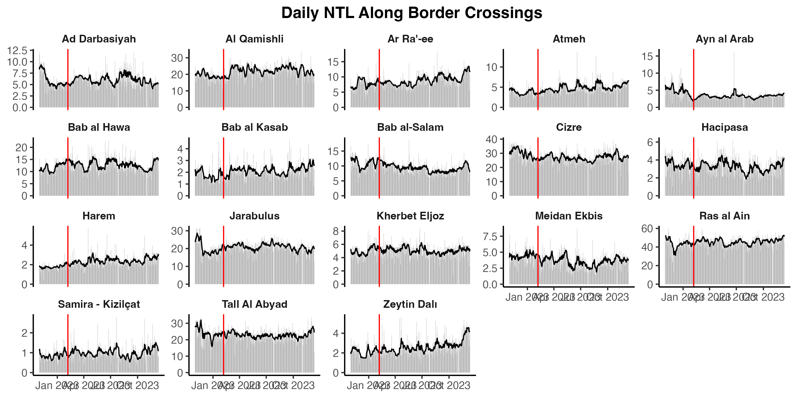
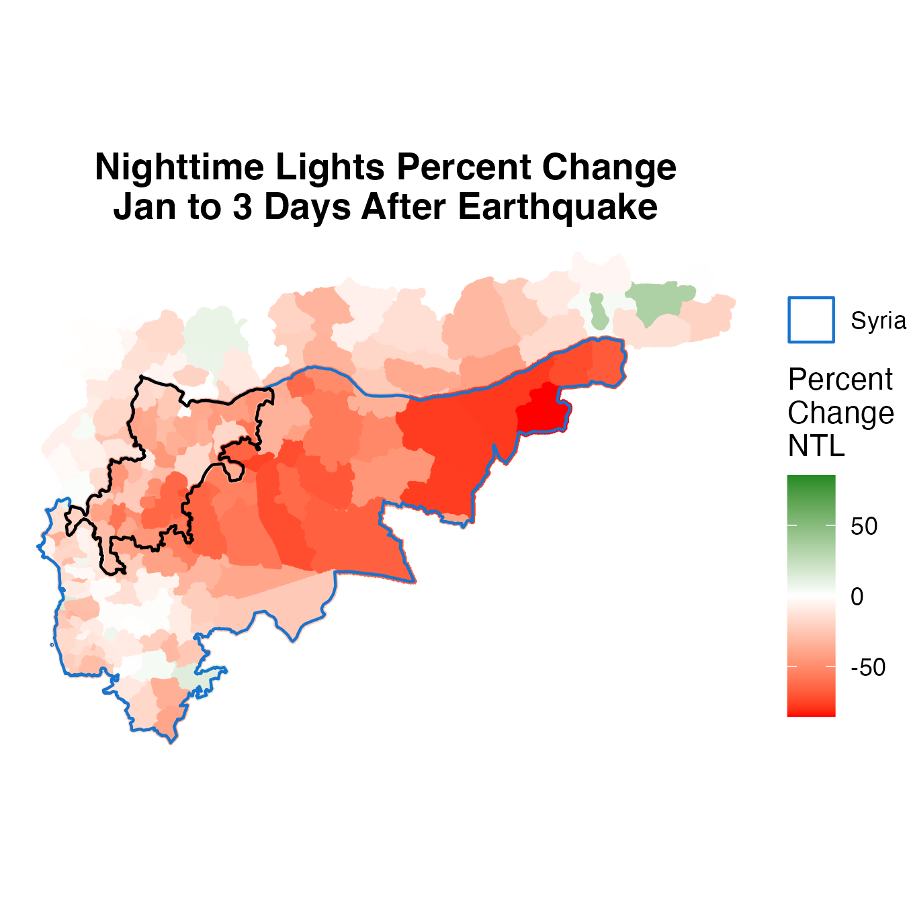
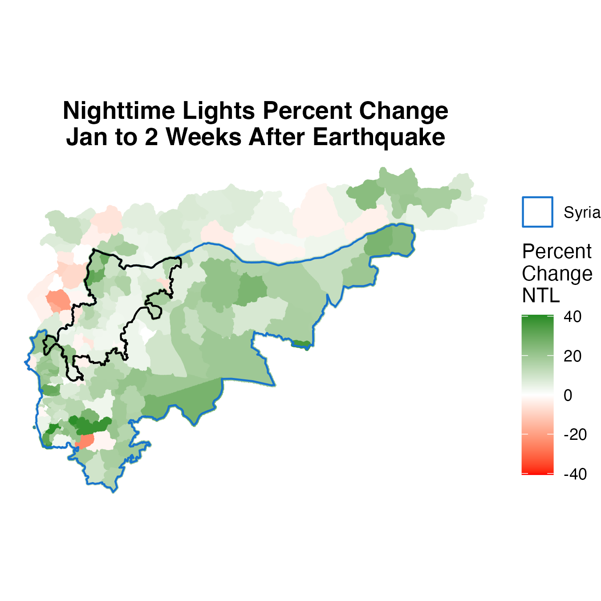
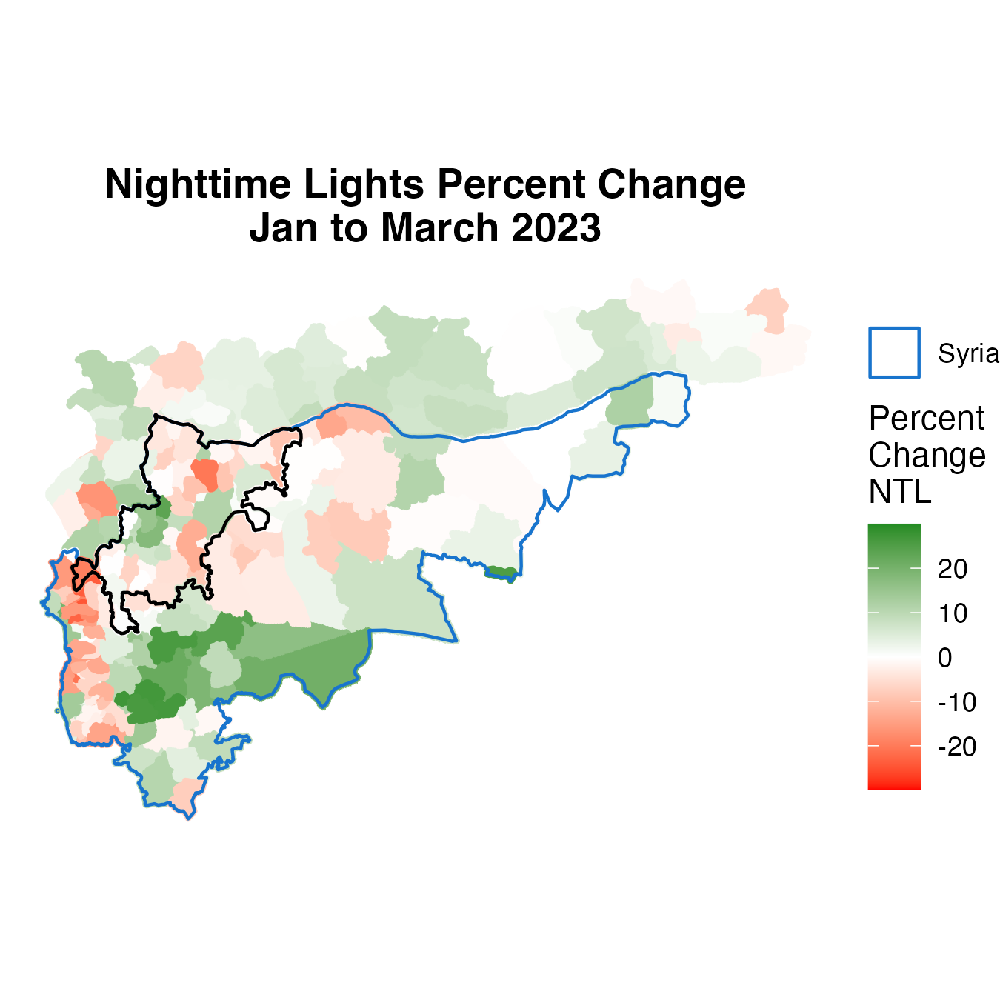
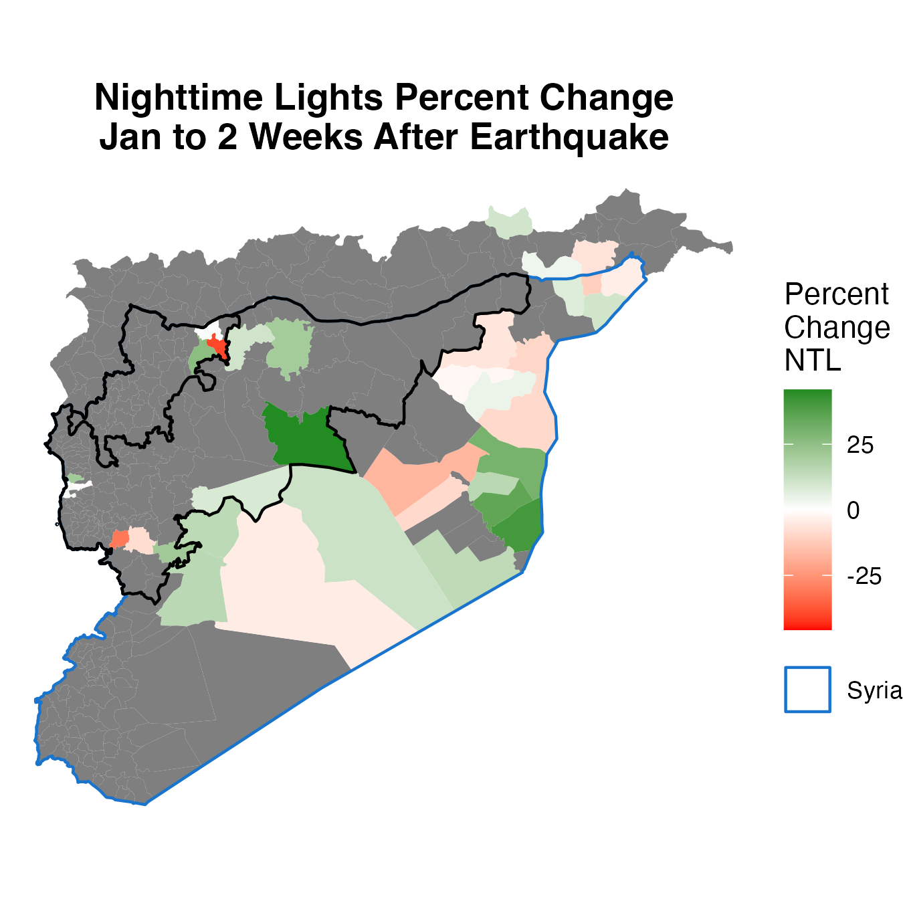
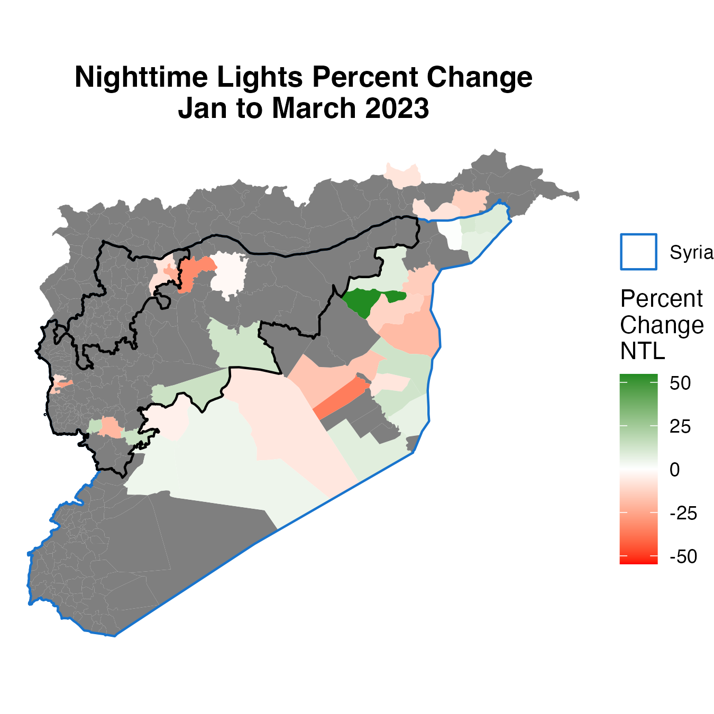

# 2023-06 Update - Nighttime Lights

We examine trends in daily nighttime lights from before and after the February 6 earthquake. Analysis of nighttime lights reveals that: (1) in the immediate days after the earthquake (~3 days), nighttime light fell, (2) in the 2 weeks after the earthquake, nighttime lights increase---particularly in the area most affected by the earthquake---likely indicating lights from rescue efforts, and (3) many locations hardest hit by the earthquake had lower nighttime lights in March 2023 compared to January.

### Trends in Nighttime Lights by Earthquake Intensity

The below figures show daily trends (and a 7 day moving average from daily data) in nighttime lights from October 1, 2022 through April 30, 2023. The first figure shows average values across subdistricts by earthquake intensity. The next two figures show nighttime lights in the most affected subdistricts. The last figure shows trends in nighttime lights in border crossing locations.

> *Average Trends in Nighttime Lights by Earthquake Intensity. The red line indicates February 6, 2023.*

> *Earthquake Intensity: Very Strong - Trends in Nighttime Lights. The red line indicates February 6, 2023.*

> *Trends in Nighttime Lights in Border Crossing Locations. The red line indicates February 6, 2023.*

###

### Maps of Percent Change in Nighttime Lights

The below maps show the percent change in nighttime lights. The figures use nighttime lights in January 2023 as baseline, and compute percent change using data (1) 3 days after the earthquake, (2) 14 days after the earthquake, and (3) in March. The first three maps show data across all of Syria, and the next three maps focus on areas where the earthquake intensity was moderate or higher.

#### All of Syria

> *Percent Change in Nighttime Lights: January to 3 Days After Earthquake. The two black lines show locations where the earthquake intensity was (a) very strong and (b) strong.*

> *Percent Change in Nighttime Lights: January to 2 Weeks After Earthquake. The two black lines show locations where the earthquake intensity was (a) very strong and (b) strong.*

> *Percent Change in Nighttime Lights: January to March. The two black lines show locations where the earthquake intensity was (a) very strong and (b) strong.Earthquake. The two black lines show locations where the earthquake intensity was (a) very strong and (b) strong.*

#### Subdistricts with Moderate or Higher Earthquake Intensity

> *Percent Change in Nighttime Lights: January to 3 Days After Earthquake. The black line show locations where the earthquake intensity was very strong.*

> *Percent Change in Nighttime Lights: January to 2 Weeks After Earthquake. The black line show locations where the earthquake intensity was very strong.*

> *Percent Change in Nighttime Lights: January to March. The black line show locations where the earthquake intensity was very strong after Earthquake.*

### Maps of Percent Change in Nighttime Lights - Only Considering Gas Flaring Locations

> *Percent Change in Nighttime Lights in Gas Flaring Locations: January to 3 Days After Earthquake. The two black lines show locations where the earthquake intensity was (a) very strong and (b) strong.*

> *Percent Change in Nighttime Lights in Gas Flaring Locations: January to 2 Weeks After Earthquake. The two black lines show locations where the earthquake intensity was (a) very strong and (b) strong.*

> *Percent Change in Nighttime Lights in Gas Flaring Locations: January to March. The two black lines show locations where the earthquake intensity was (a) very strong and (b) strong.*
