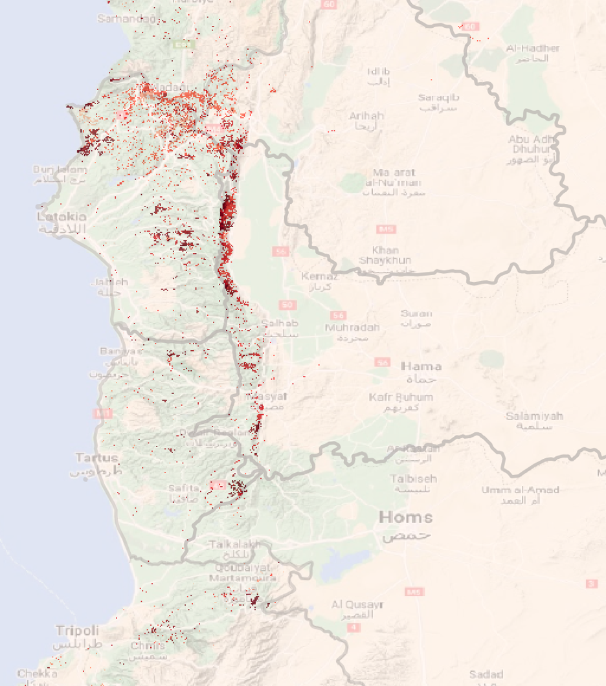
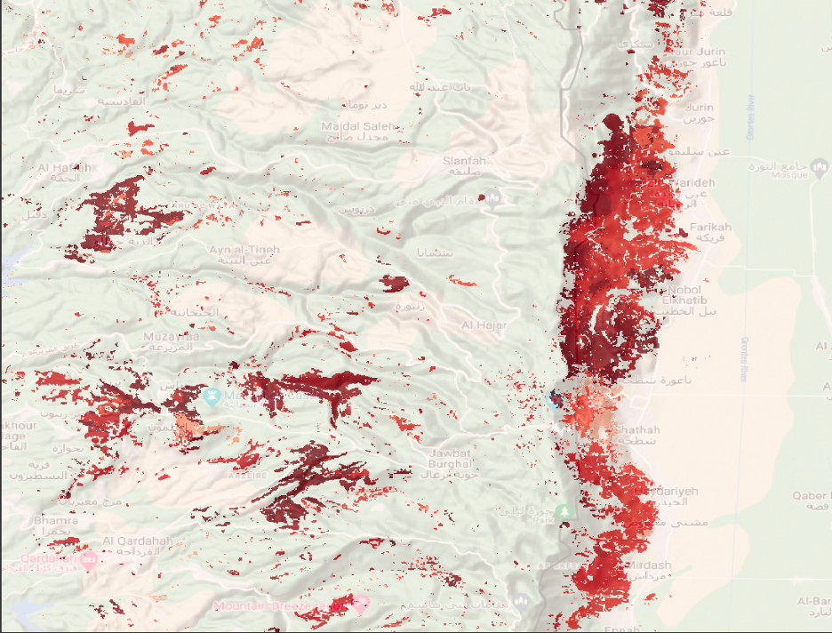
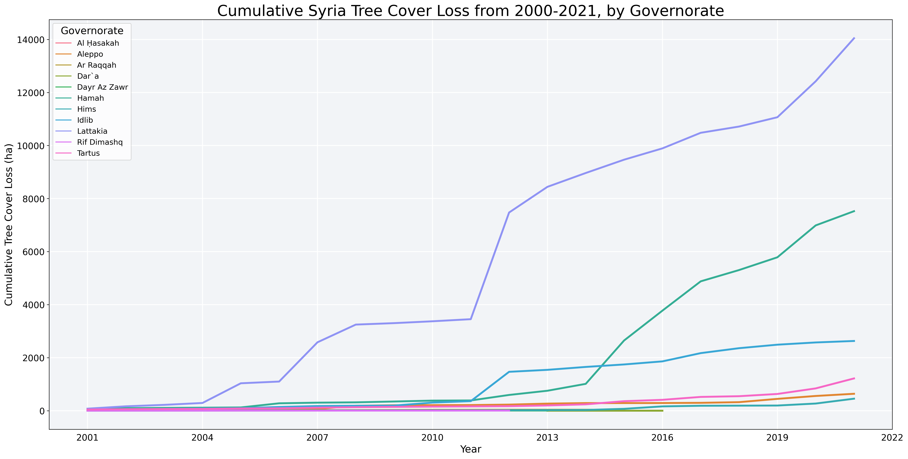

# Tree Cover Loss Analysis

## Data

The [Global Forest Watch](https://www.globalforestwatch.org/) is an online platform for monitoring changes in global forest cover. Its tree coverage data are sourced from a [University of Maryland time-series analysis of Landsat images](http://earthenginepartners.appspot.com/science-2013-global-forest/download_v1.7.html) that show global forest extent and change. These data can be downloaded for free, as .tiff files.

Following are example of what these files look like rendered using QGIS, in Syria, covering the period 2000-2021. The intensity of the red color is commensurate with the intensity of forest cover loss. The basemaps sourced from Google terrain maps, which are available using the [OpenLayers](https://plugins.qgis.org/plugins/openlayers_plugin/) QGIS plugin.

*Figure 1: Tree cover loss in northwest Syria, from 2000-2021*

*Figure 2: Tree cover loss in eastern Lattakia, from 2000-2021 (zoomed in)*

Global Forest Watch uses these geospatial data to derive statistics for annual hectares of tree cover loss, aggregated by administrative level 1 ("Admin 1"). These statistics can be downloaded as .csv's, using the [Forest Watch Dashboard](https://www.globalforestwatch.org/dashboards/global/?category=summary&location=WyJnbG9iYWwiXQ%3D%3D&map=eyJkYXRhc2V0cyI6W3siZGF0YXNldCI6InBvbGl0aWNhbC1ib3VuZGFyaWVzIiwibGF5ZXJzIjpbImRpc3B1dGVkLXBvbGl0aWNhbC1ib3VuZGFyaWVzIiwicG9saXRpY2FsLWJvdW5kYXJpZXMiXSwiYm91bmRhcnkiOnRydWUsIm9wYWNpdHkiOjEsInZpc2liaWxpdHkiOnRydWV9LHsiZGF0YXNldCI6Ik5ldC1DaGFuZ2UtU1RBR0lORyIsImxheWVycyI6WyJmb3Jlc3QtbmV0LWNoYW5nZSJdLCJvcGFjaXR5IjoxLCJ2aXNpYmlsaXR5Ijp0cnVlLCJwYXJhbXMiOnsidmlzaWJpbGl0eSI6dHJ1ZSwiYWRtX2xldmVsIjoiYWRtMCJ9fV19&showMap=true).

## Implementation

From the Forest Watch Dashboard, we can download .csv files of annual hectares of tree cover loss, aggregated by Admin 1, as well as a separate file that includes the ID numbers and matched names of the administrative areas.

The first step is to merge the Admin 1 ID table with the data table. Then, we can create a table of cumulative annual tree cover loss, aggregated by Admin 1. With that, we can generate simple statistics about which areas are responsible for the most tree-cover loss over time and when.

## Findings

From 2000 to 2021, Syria has lost 26,576 hectares of forest cover, with loss begining to escalate in  2011. The following line chart shows the pace of tree cover loss over this period.

The table, below, shows the three governorates responsible for more than 90% of the country's tree cover loss: Lattakia, Hamah, and Idlib.

| Governorate | Tree Cover Loss (ha) | Percent National Total |
| ----------- | --------------------:| ----------------------:|
| Lattakia    | 14,045               | 53%                    |
| Hamah       | 7,524                | 28%                    |
| Idlib       | 2,630                | 10%                    |

## Limitations

Global Forest Watch data can detect tree-cover loss but cannot detect the causes of the tree cover loss -- that is, whether the loss is due to deforestation, forest fire, or other natural cause.
