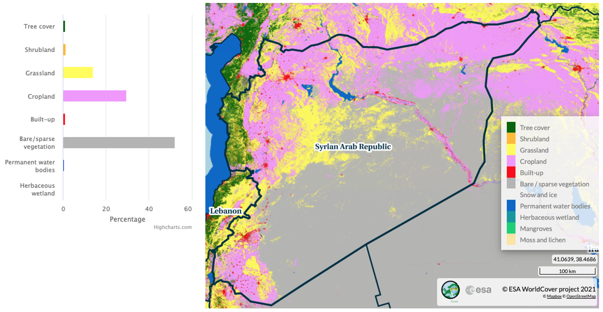

# Monitoring vegetation conditions

The importance of monitoring vegetation conditions cannot be overstated, particularly in countries like Syria, where ongoing conflicts and environmental changes have had significant impacts on the landscape. Vegetation serves as an essential component of the Earth's ecosystem, playing a crucial role in maintaining biodiversity, supporting agriculture, and regulating climate. Continuous monitoring of vegetation dynamics can provide valuable insights into ecosystem health, early warnings of environmental degradation, and identify opportunities for sustainable land management practices.



**Figure 1.** Syria land cover.

Remote sensing techniques, such as those employed through the use of Moderate Resolution Imaging Spectroradiometer ([MODIS](https://modis.gsfc.nasa.gov/about/)) Terra ([MOD13Q1](https://lpdaac.usgs.gov/products/mod13q1v061/)) and Aqua ([MYD13Q1](https://lpdaac.usgs.gov/products/myd13q1v061/)) Vegetation Indices 16-day L3 Global 250m time series data, have revolutionized the way we monitor vegetation conditions. By deriving variables such as ratio anomaly, difference anomaly, standardized anomaly, and vegetation condition index, these analyses enable the quantification of vegetation changes over time and across vast spatial extents. 

Regular vegetation monitoring provides numerous benefits, including the ability to detect and mitigate the impacts of deforestation, land degradation, and desertification, as well as monitor crop health and inform agricultural decision-making. Furthermore, such monitoring can guide policymakers in the development of adaptive strategies and environmental policies, ensuring a sustainable future for the country and its people.

Building on the foundation of monitoring vegetation conditions using MODIS MOD13Q1 and MYD13Q1 time series data, a more comprehensive understanding of vegetation dynamics in cropland areas can be achieved by incorporating phenological analysis. This is particularly important in a country like Syria, where agriculture is a vital sector for the economy and food security. Accurate and timely information on crop phenology can significantly enhance agricultural management, resource allocation, and the overall resilience of the farming sector.

To achieve this, the use of [TIMESAT](https://web.nateko.lu.se/timesat/timesat.asp), a software tool designed for the analysis of time series data, can be employed to extract critical phenological parameters such as the Start of Season (SOS), Mid of Season (MOS), and End of Season (EOS) from the Enhanced Vegetation Index (EVI) data. By first clipping the EVI data to the cropland extent, the analysis becomes more focused on the regions of interest, ensuring that the extracted parameters are directly relevant to agricultural practices. 

This phenological information can then be used to guide farmers and agricultural stakeholders in making timely and informed decisions, such as when to plant, irrigate, or harvest their crops. Moreover, it can help identify potential threats to crop health and yield, such as disease outbreaks, pest infestations, or the effects of climate change, allowing for proactive and targeted interventions. Ultimately, incorporating phenological analysis into vegetation monitoring efforts provides a more holistic and actionable understanding of the complex dynamics that govern agricultural productivity and environmental sustainability.

## Data

In this study, we utilize a range of high-quality datasets to analyze vegetation conditions and phenology within Syria's cropland areas. The Data section introduces the sources of information employed, setting the stage for the methodologies and results presented later in the study. Our analysis incorporates EVI data from the MOD13Q1 and MYD13Q1 products and the cropland extent provided by the ESA WorldCover 2021 dataset. Combining these datasets allows for a focused assessment of the agricultural landscape, enabling a deeper understanding of the factors influencing agricultural productivity and environmental sustainability in the region.

### Crop extent

We used the new [ESA World Cover](https://esa-worldcover.org/en) map 10m LULC to mask out areas which aren't of interest in computing the EVI, i.e. built-up, water, forest, etc. The cropland class has value equal to 40, which will be used within Google Earth Engine to generate the mask. 

There are many ways to download the WorldCover, as explained in the WorldCover [Data Access](https://esa-worldcover.org/en/data-access) page.


**Figure 2.** Cropland

### Vegetation Indices

The EVI from both MOD13Q1 and MYD13Q1 downloaded using Google Earth Engine ([GEE](https://earthengine.google.com/)) which involves some process:

 * Combine the two 16-day composites into a synthethic 8-day composite containing data from both Aqua and Terra.

 * Applying Quality Control Bitmask, keep only pixels with good quality.

 * Applying cropland mask, keep only pixels identified as a cropland based on ESA WorldCover.

 * Clipped for Syria and batch export the collection to Google Drive.


**Figure 3.** Vegetation indices, December-January-February 2023.

## Products

We present a summary of the key derived variables employed in our analysis to monitor vegetation conditions and dynamics within Syria's cropland areas. These variables, which are derived from the EVI data and the cropland extent, enable a comprehensive understanding of the factors influencing agricultural productivity and environmental sustainability in the region.

```{note}
It is important to note that the original MODIS EVI data downloaded from sources such as USGS or GEE is provided in a range of 0-10,000 to minimize storage requirements and maintain data integrity. To convert these values to their actual EVI range of 0-1, it is typically necessary to multiply the data by a scale factor of 0.0001. However, in this study, we have opted to retain the unscaled values to conserve storage space and ensure efficient data processing.

Please be aware that the derived variables and any subsequent analysis conducted in this study will be based on the original, unscaled EVI values. The results and interpretations should be considered accordingly, acknowledging that the values presented are in the 0-10,000 range rather than the conventional 0-1 EVI range. This approach does not compromise the overall analysis, but users of the data and findings should be mindful of the difference in scale when comparing the results to other studies or datasets that use the standard EVI scaling.
```

### Vegetation-derived anomaly

This study focuses on analyzing various EVI derived products, such as the ratio, difference, standardized anomaly, and Vegetation Condition Index (VCI). These derived products provide valuable insights into vegetation health, vigor, and responses to environmental factors like climate change and land-use practices. By examining the EVI-derived products, we can assess vegetation dynamics and identify patterns and trends that may impact ecosystems and human livelihoods.

#### Ratio Anomaly

This variable represents the relative difference between the current vegetation condition and the long-term average, expressed as a ratio. By comparing current EVI values to historical trends, ratio anomalies can help identify areas experiencing significant deviations in vegetation health, which may indicate potential issues such as drought, disease, or pest infestation.

The anomaly is calculated based on percentage of the average

`"anomaly (%)" = 100 * ("evi" / "mean_evi")`

where `evi` is current EVI and `mean_evi` is the long-term average of EVI.


**Figure 4.** Ratio anomaly, 6-21 March 2023

#### Difference Anomaly

Similar to the ratio anomaly, the difference anomaly measures the absolute difference between the current vegetation condition and the long-term average. This variable can provide insights into the magnitude of deviations in vegetation health, aiding in the detection and prioritization of regions requiring intervention or further investigation.

The anomaly is calculated based on difference from the average

`"anomaly (%)" = "evi" - "mean_evi"`

where `evi` is current EVI and `mean_evi` is the long-term average of EVI.


**Figure 5.** Difference anomaly, 6-21 March 2023

#### Standardized Anomaly

The standardized anomaly is a dimensionless measure that accounts for variations in the mean and standard deviation of the time series data, allowing for a more robust comparison of anomalies across different regions or time periods. This variable can help identify abnormal vegetation conditions that may warrant further analysis or management action.

The anomaly is calculated based on difference from the average and standard deviation

`"anomaly (%)" = ("evi" - "mean_evi") / "std_evi"`

where `evi` is current EVI and `mean_evi` and `std_evi` is the long-term average and standard deviation of EVI.


**Figure 6.** Standardized anomaly, 6-21 March 2023

#### Vegetation Condition Index (VCI)

The VCI is a normalized index that ranges from 0 to 100, with higher values indicating better vegetation health. Derived from the EVI data, the VCI provides a concise measure of the overall vegetation condition, enabling the identification of trends and patterns in vegetation dynamics, as well as the evaluation of the effectiveness of management interventions.

The anomaly is calculated based on difference from the average and standard deviation

`"vci" = 100 * ("evi" - "min_evi") / ("max_evi" - "min_evi")`

where `evi` is current EVI and `mean_evi` and `std_evi` is the long-term average and standard deviation of EVI.


**Figure 7.** Vegetation Condition Index, 6-21 March 2023

### Phenological metrics

In addition to the previously mentioned vegetation indices and derived products, this study also focuses on analyzing key phenological metrics, such as the Start of Season (SOS), Mid of Season (MOS), and End of Season (EOS). These metrics provide essential information on the timing and progression of the growing season, offering valuable insights into plant growth and development. By examining SOS, MOS, and EOS, we can assess the impacts of environmental factors, such as climate change and land-use practices, on vegetation dynamics. Furthermore, understanding these phenological patterns can help inform agricultural management strategies, conservation efforts, and policies for sustainable resource management.

#### Start of Season (SOS)

The SOS is a critical phenological metric that represents the onset of the growing season. By analyzing the timing of SOS, we can gain insights into how environmental factors, such as temperature and precipitation, impact vegetation growth and development. Understanding the SOS is vital for agricultural planning, as it can inform planting and harvesting schedules, irrigation management, and help predict potential yield outcomes.


**Figure 8.** Start of Season, 2022

#### Mid of Season (MOS)

The MOS is an essential phenological parameter that indicates the peak of the growing season. Examining MOS can provide valuable information about the overall health and productivity of vegetation, as it typically corresponds to the period of maximum photosynthetic activity and biomass accumulation. Assessing MOS trends can help identify changes in vegetation dynamics due to climate change, land-use practices, or other environmental stressors, and support the development of effective management strategies for agriculture and natural resources.


**Figure 9.** Mid of Season, 2022

#### End of Season (EOS)

The EOS is an important phenological marker signifying the conclusion of the growing season. Investigating the timing of EOS can reveal valuable information about the duration of the growing season and the overall performance of vegetation. EOS trends can help us understand how factors such as temperature, precipitation, and human-induced land-use changes impact ecosystems and their productivity. Information on EOS is also crucial for agricultural management, as it aids in planning harvest schedules and post-harvest activities, and supports the development of informed land management and conservation policies.


**Figure 10.** End of Season, 2022

## Implementation

We utilized GEE to acquire a time series of EVI data. The EVI data was then processed using the ArcPy library in ArcGIS to generate long-term statistics and derive various vegetation indices products. Following this, we employed the TIMESAT software to extract seasonality parameters from the processed vegetation data.

### Vegetation Indices and derivative product

In this study, we employed a three-step coding approach to analyze the time series EVI data and derive vegetation index products. The first step utilized GEE to efficiently batch download the time series EVI data. 

* The code for downloading timeseries EVI in GEE: [gee-batch-export-mxd13q1.js](../gee-batch-export-mxd13q1.js)

Following this, an ArcPy script was executed to process the acquired data and calculate long-term statistics from the time series.

* The code for calculating long-term statistical value of EVI in Arcpy: [modis_8daystats.py](../modis_8daystats.py)

Lastly, another ArcPy script was employed to compute various vegetation index derived products, such as the ratio, difference, standardized anomaly, and VCI.

* The code for calculating derived EVI products in Arcpy: [modis_viproducts.py](../modis_viproducts.py)

### Phenological Metrics

The SOS, MOS, and EOS are typically derived from EVI. These metrics are calculated using various methods that identify critical points or thresholds in the vegetation index time series data. One common approach is the Timesat software, which fits functions (e.g., logistic, asymmetric Gaussian, Savitsky-Golay, Whittaker) to the time series data to identify these points. Here's a general overview of the approach:

1. Preprocessing: Detrend and smooth the vegetation index time series data to reduce noise.

2. Model Fitting: Fit a function (e.g., logistic, asymmetric Gaussian) to the smoothed time series data. The chosen function should adequately represent the seasonal pattern of vegetation growth and senescence.

3. Threshold Determination: Define thresholds for SOS, MOS, and EOS. These thresholds may be absolute values, or they may be based on a percentage of the maximum vegetation index value for the season (e.g., 20% for SOS and EOS, 100% for MOS).

4. Metric Calculation: Identify the points in the fitted function where the thresholds are met. These points correspond to the SOS, MOS, and EOS.

	* SOS: The time step where the fitted function first exceeds the lower threshold, marking the start of significant vegetation growth.

	* MOS: The time step where the fitted function reaches the maximum vegetation index value, indicating the peak of the growing season.

	* EOS: The time step where the fitted function falls below the lower threshold again, signifying the end of significant vegetation growth.

Note that these metrics will depend on the choice of function, thresholds, and other methodological details. The equations for calculating SOS, MOS, and EOS may vary depending on the specific technique employed.

A how-to guideline on calculating the phenological metrics are available through **[Seasonality_Parameters_Data_Extraction](../Seasonality_Parameters_Data_Extraction.md)**

## Limitations and Assumptions

Getting VI data with good quality for all period are challenging (pixels covered with cloud, snow/ice, aerosol quantity, shadow) for optic data (MODIS). Cultivated area year by year are varies, due to MODIS data quality and crop type is not described, so the seasonal parameters are for general cropland. 

At this point, the analysis is also limited to seasonal crops due to difficulty to capture the dynamics of perennial crops within a year. The value may not represent for smaller cropland and presented result are only based upon the most current available remote sensing data. As the climate phenomena is a dynamic situation, the current realities may differ from what is depicted in this document.

Ground check is necessary to ensure if satellite and field situation data are corresponding.

## Potential Application 

Above products provides an important starting point for continuous monitoring of the crop planting status. Continuous monitoring could inform the following assessments:

1. How many districts are behind in planting? If there is a delay in some districts, and is planting acceleration necessary?
2. How many hectares are available for the next season?
3. Is the current harvest enough for domestic consumption?

Decision makers also need phonological data to decide on resource allocation issues or policy design:

1. Planting potential for the next months: assigning the distribution of agricultural inputs.
2. Mobilization of extension workers to monitor and implement mitigation strategies: adjustment of irrigation system in anticipation of drought or flood, pest control of infestation/disease to avoid crop failure, reservoir readiness for planting season.
3. Preparation of policy recommendations: assess ongoing situation, harvest estimate, price protection.

This information is necessary for both policy makers, farmers, and other agricultural actors (cooperatives, rural businesses). Negative consequences can be anticipated months ahead and resources can be prioritized on areas with higher risk or greater potential.