# Seasonality Parameters Data Extraction

A working example to detect seasonality parameters in Syria has been developed based on areas where the majority is a cropland. This approach requires a crop type mask and moderate resolution time series Vegetation Indices (VI). In this example, we use data from the MODIS.

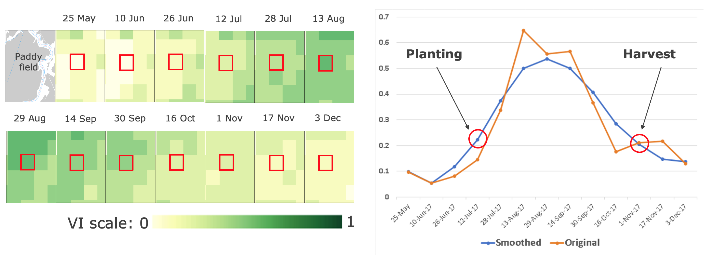

**Figure 1.** Growing season detection on a cropland

State of planting and harvesting estimates are determined by importing Vegetation Indices (VI) data into [TIMESAT](http://web.nateko.lu.se/timesat/timesat.asp) – an open-source program to analyze time-series satellite sensor data. TIMESAT conducts pixel-by-pixel classification of satellite images to determine whether planting has started or not. This process is followed for all areas over multiple years to evaluate current planting vis-à-vis historical values from 2003 - 2023 (in this case with MODIS EVI data).


**Figure 2.** TIMESAT Parameters

The main seasonality parameters generated in TIMESAT are (a) beginning of season, (b) end of season, (c) length of season, (d) base value, (e) time of middle of season, (f) maximum value, (g) amplitude, (h) small integrated value, (h+i) large integrated value. The blue line in Figure 11 shows the raw EVI time series, while the red line shows the EVI values after applying a Savitsky-Golay smoothing algorithm. The phenological parameters detected describe key aspects of the timing of agricultural production and are closely related to the amount of available biomass.

This section will explain on how to prepare the Vegetation Indices (VI) as input for seasoanlity parameters data extraction.

This step-by-step guide was tested using Windows 11 running on Thinkpad T480 2019.

## 0. Working Directory

For this tutorial, we are working on these folder `X:/Temp/modis/syr/` directory. I have some folder inside this directory:

1. `input`
	1. `01_tif` Place for the VI in `.tif` which already clipped with the Cropland.
	2. `02_bil` Place to put the flat-binary files, result from GDAL conversion

	Place to put downloaded VI data, and pre-process temporary files.

2. `output` 
	1. `01_raw_seasonality_metrics` Place for raw outputs seasonality files generated by TIMESAT
	2. `02_tif_seasonality_metrics` Place for ready-to-used seasonality raster (`.tif`) files
	3. `03_extract_date` Place for extract each seasonality date
	4. `04_dbf` Place for `dbf` files generated from Zonal Statistics Tools
	5. `05_csv` Final output, statistics information per admin boundary

Feel free to use your own preferences for this setting/folder arrangements.

## 1. Software Requirement

This whole process requires the support of several software.

### 1.1. TIMESAT

To investigate the seasonality of satellite time-series data and their relationship with dynamic properties of vegetation, such as phenology and temporal development, we will use [TIMESAT](https://web.nateko.lu.se/timesat/timesat.asp) software - a software package for analysing time-series of satellite sensor data. 

TIMESAT available for download via this link [https://web.nateko.lu.se/timesat/timesat.asp?cat=4](https://web.nateko.lu.se/timesat/timesat.asp?cat=4). You are required to register first before downloading the software.

Details about TIMESAT are available via the guideline, access the PDF through [User manual for version 3.3](https://web.nateko.lu.se/personal/Lars.Eklundh/TIMESAT/prog/version33/TIMESAT33_SoftwareManual.pdf)

### 1.2. GDAL

[GDAL](https://gdal.org/) will use to translate the input to flat-binary files and the binary output files into GIS-ready format like a GeoTIFF files. You can install GDAL via `conda`.

## 2. Getting started with TIMESAT

You can access TIMESAT from `C:/timesat33/compiled/Win64`, double-click `TIMESAT.exe`.

### 2.1. Starting the TIMESAT menu system

The main driver for all TIMESAT processing, Matlab or Fortran, is a menu system. The menu system is divided into three logical areas: data preparation, data processing, and post processing.

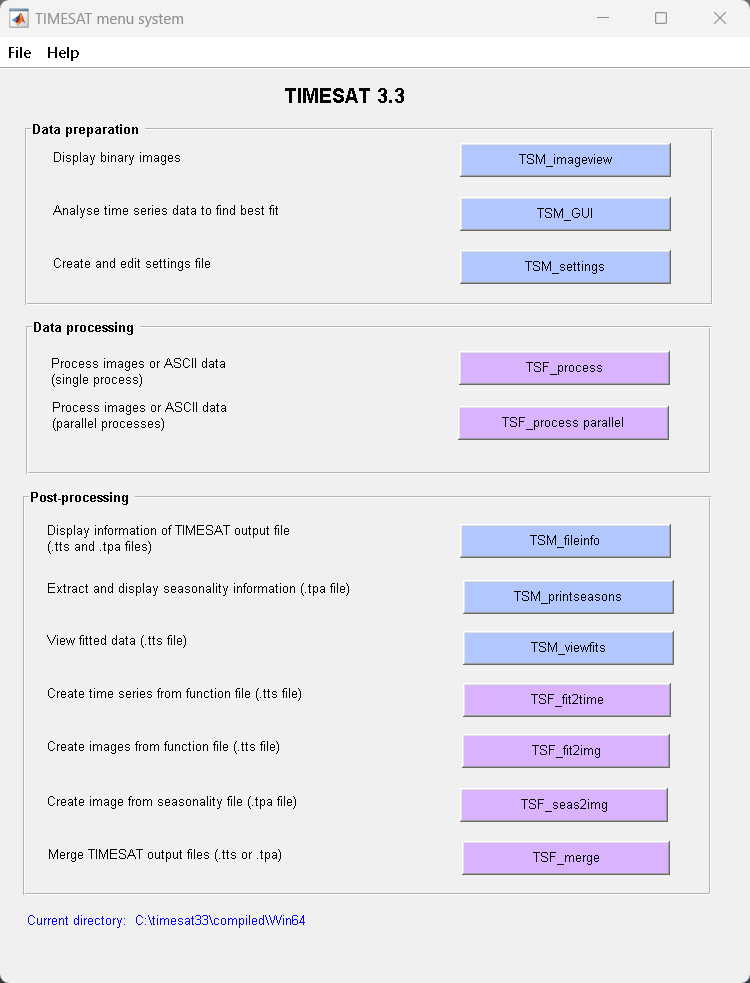

**Figure 3.** TIMESAT graphical user interface

### 2.2. Preparing the data

**Images input**

* TIMESAT needs a sequence of vegetation index images covering a particular geographical area. Images should be converted to headerless binary format. 

* The number of images needs to be identical for each year, and each image should represent the same time interval (e.g. one day, 8-days, 10-days, 1 month etc.). 

* If an image representing a certain date is missing, an image denoting missing data should be added. This image should contain numerical values outside the range of the valid data.

* TIMESAT uses flat binary files: identical to Idrisi `.rst` or ENVI default BSQ formats, except that both ENVI and IDRISI require accompanying header files (`.hdr` and `.rdc` respectively). It means that these data files can be used directly with TIMESAT, without the header files and without renaming. However, the user has to specify the organization of the data in each TIMESAT module.

* Other data formats (`HDF`, Erdas Imagine `.img`, etc.) have to be converted to flat binary format , to IDRISI or to ENVI formats.

	Use `gdal_translate` to convert GeoTIFF data to ENVI header less binary format:

	```bash
	gdal_translate –of ENVI input.tif output.bil
	```
**List of input files**

A list giving the total number of files and the full filename and path of each image needs to be present. An example is the file `syr_data_2022_gee_raw.txt` below:

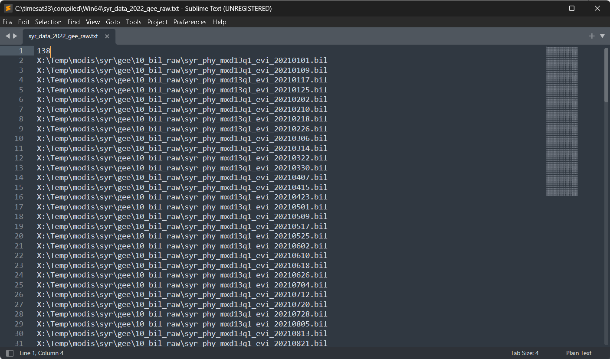

**Figure 4.** List of data

The first row contains the number of data files (images), then comes one image name (includingpath) per row.

### 2.3. Image view

**Viewing images**

* Start TSM_imageview from the TIMESAT menu system. Under File, Open image file, browse to the folder `02_bil` and click on one of `.bil` file. 

* The files contain EVI data from the MODIS sensor. Change the choice under Image file type to 16-bit signed integer. Type `2229` under No of rows in image, and `3016` under No of columns per row. Click the Draw button. 

	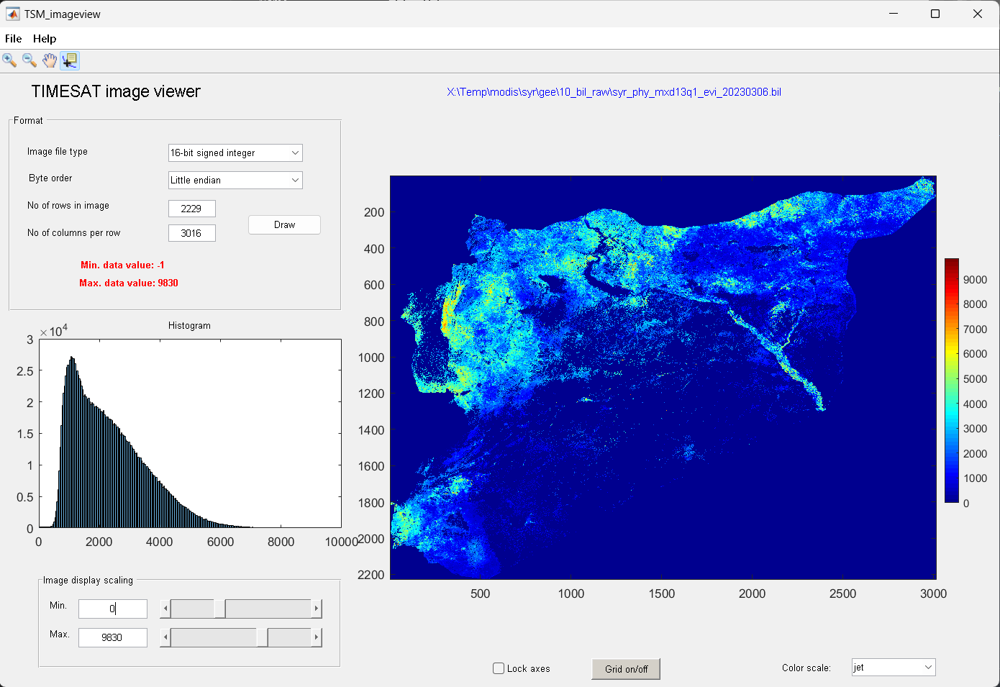

	**Figure 5.** Viewing input data

* To modify the Image display scaling you can increase the Minimum value to about 0 and decrease the Maximum value to about 10000 (enter these numbers in the edit boxes near the bottom left window corner, or use the sliders). Also try out the other options below the image area: Zoom on/off, Lock axes, Grid on/off, Data tip on/off, and Color scale.

**Browsing through several files**

* If you have made sure that your file list correctly points to your vegetation index image data, you may use the function Open file list under File. 

* Click on the Open file list button and browse to folder the file `syr_data_2022_gee_raw.txt`, select it. 

* Click on one of the files, leave the window open and go over to the main window. 

* Choose the correct settings under Format and click the Draw button. You can then point to another file in the list and just click the Draw button again to view this image file.

	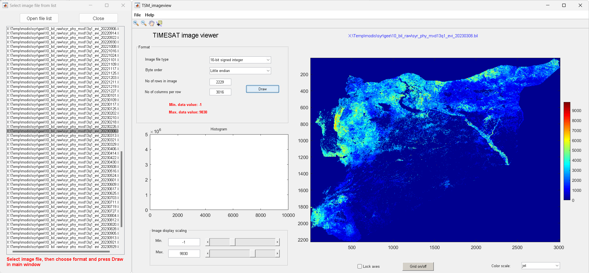

	**Figure 6.** Viewing list of input data

### 2.4. GUI

**Loading and processing ASCII time-series files**

* In this example we will load and process data stored in an ASCII time-series file.

* Click on TSM_GUI in the TIMESAT menu system

* Then select File, Open ASCII data file. Use the Browse button to open the file `syr_data_2022_gee_raw.txt`. 

* This file contains EVI data from MODIS for the time period 2021 – 2023. Note the preview of the file contents loaded into the window. 

* The first row shows that there are 3 years of data, 46 observations per year. Press Load data. The raw data from the first row of the file will load into the plotting area of TSM_GUI.

	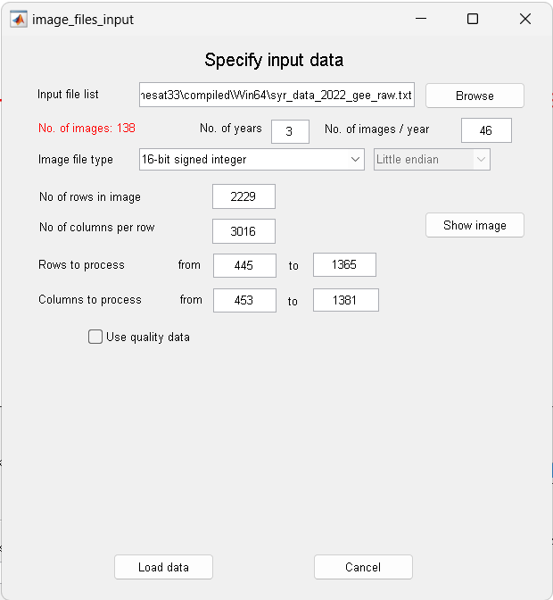

	**Figure 7.** Specify input data

* Next, select and unselect the different check boxes under Data plotting. Note the different fits achieved with `Gaussian`, `Logistic` and `Savitsky-Golay`. 

* The fits are affected by a number of options for detecting spikes, adapting to the upper envelope etc. These options can be controlled by the check boxes and buttons in the GUI either under Common settings or Class-specific settings. 

* There are more options, including the Spike method, Number of envelope iterations and Adaptation strength, that you might want to explore.

	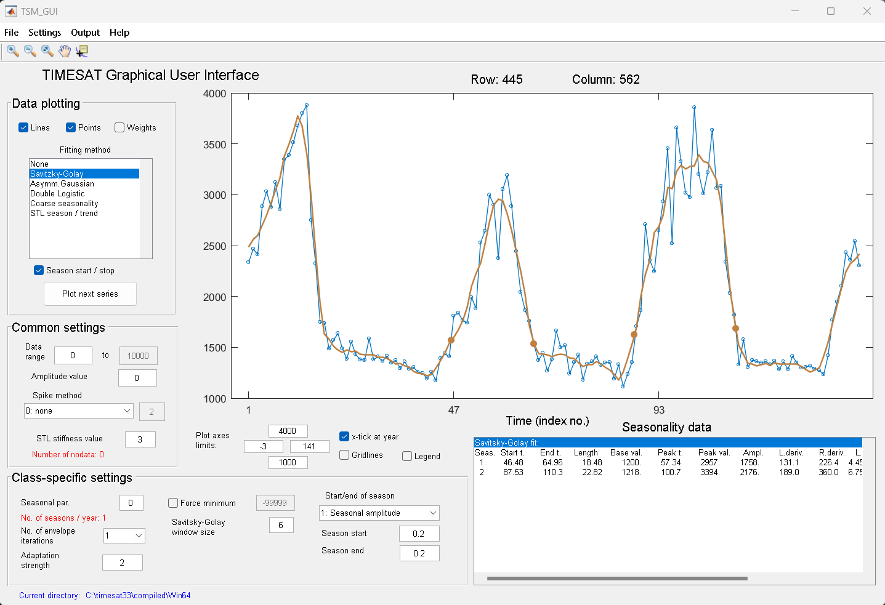

	**Figure 8.** Data ploting

**Setting parameters**

* We can also edit the exisiting parameters by accessing the input setting tool. Let say we have edit some parameters, and save the setting as file `syr_2022_gee_raw.set`

	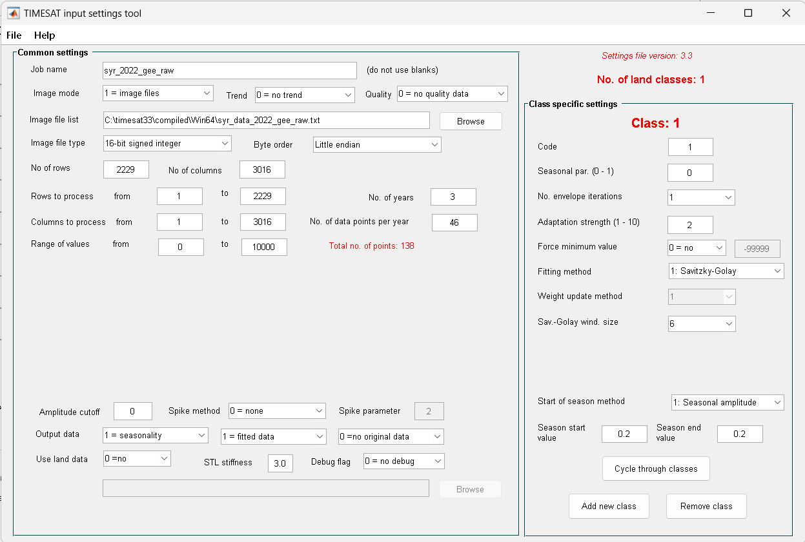

	**Figure 9.** Input setting tool

### 2.5. Process

* To start the program click on `TSF_process` in the TIMESAT menu system. 

* TIMESAT will ask for the input settings file. Select the file `syr_2022_gee_raw.set`. 

* A command window will then open and `TSF_process` will start running immediately. 

* You can also start `TSF_process` directly from a separate command window by typing `TSF_process`.

	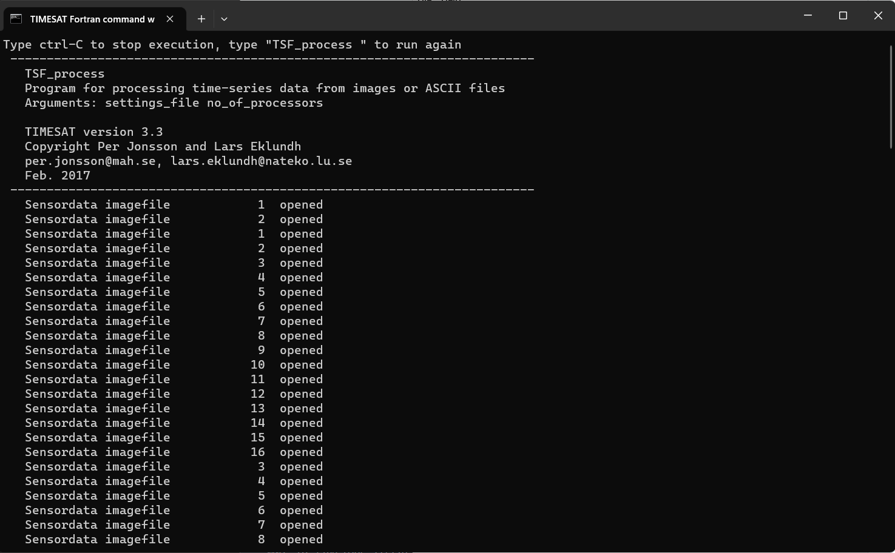

	**Figure 10.** TSF_process

* The program will process the data row by row. As you will notice, when having large data files the processing can take considerable time.

* Data from the processing are saved to file. Check the contents of your current working directory and note that the two files `syr_2022_gee_raw_TS.tpa`, `syr_2022_gee_raw_fit.tts`, and corresponding index files `.ndx` have been created

### 2.6. Post processing

The main TIMESAT processing is now done and we will see how data can be post-processed and viewed. TIMESAT provide a few basic programs for opening and processing the output files: `TSM_fileinfo`, `TSM_printseasons`, `TSM_viewfits`, `TSF_fit2time`, `TSF_fit2img`, `TSF_seas2img`, but for certain processing the user may be required to create tailored software.

As example, we only utilized `TSF_seas2img` to extract the seasonal parameters

**TSF_seas2img: Creating an image from the seasonality data**

* This program generates an image from the seasonality parameters generated by Timesat. 

* Click on `TSF_seas2img` in TSM_menu. 

* Now enter the seasonality file `syr_2022_gee_raw_TS.tpa`. Then specify the seasonality parameter to map. Here we will map the Time of Middle Season, `5`. 

* Then specify an interval that is wide enough to cover the second season. A suggestion is to specify this interval to `47` to `92` since this will overlap the second year. 

* Define codes for missing data due to no season found within the interval, and no pixel data at all found at that location. 
Finally, give a name of the output file, and specify its format. 

* Carefully note the format since it is important when viewing the file with TSM_imageview. Here we will give the name begin, and specify output in full precision, `16-bit`. 

	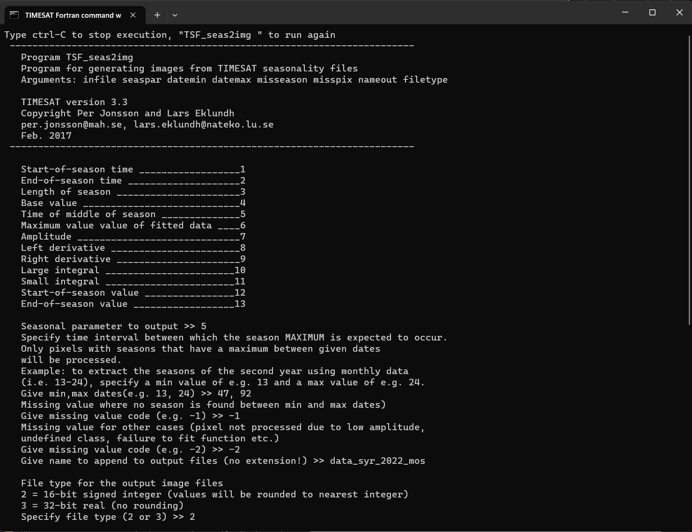

	**Figure 11.** Extract seasonality

* Below are some outputs, if you run all the command: `TSM_fileinfo`, `TSM_printseasons`, `TSM_viewfits`, `TSF_fit2time`, `TSF_fit2img`, `TSF_seas2img`. The last two generated by `TSF_seas2img`, we will use for further analysis.

	| Output | Description |
	|---|---|
	| `syr_2022_gee_raw_TS.tpa` | Binary file containing Timesat parameters. |
	| `syr_2022_gee_raw_fit.tts` | Binary file containing fitted data values. |
	| `syr_2022_gee_raw_raw.tts` | Binary file containing original time-series values. |
	| `timeseriesfile.txt` | ASCII file containing fitted data values for selected pixels. |
	| `syr_2022_gee_raw_fit_4792` | 6-bit signed integer image file containing fitted data value for time step 47 to 92. |
	| `syr_2022_gee_raw_mos_nseas` | Binary image file containing no. of seasons. |
	| `syr_2022_gee_raw_mos_both_seasons` | Binary image file containing both of seasons. |
	| `syr_2022_gee_raw_mos_season1` | Binary image file containing the selected seasonality parameter for the first season identified within the time interval specified. |
	| `syr_2022_gee_raw_mos_season2` | Binary image file containing the selected seasonality parameter for the second season identified within the time interval specified. |

### Output file

* All TIMESAT output files are header-less binary

* We need to create a header for each files

	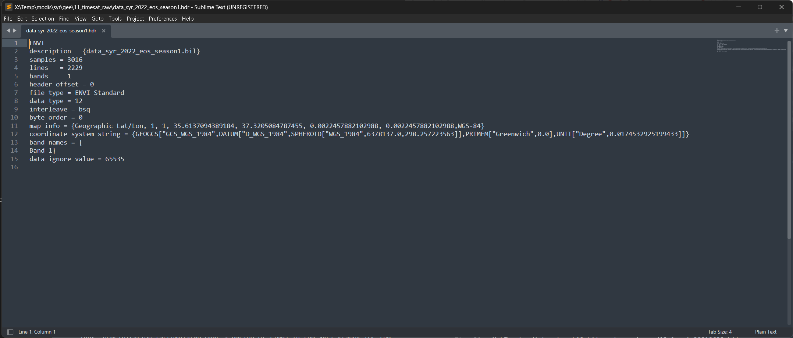

	**Figure 11.** Header file for flat-binary

* Translate all the output files to GeoTIFF

* We can use `gdal_translate`, and here’s the script

	```bash
	gdal_translate -of GTiff -co COMPRESS=LZW -co PREDICTOR=1 syr_2022_gee_raw_mos_season1 syr_2022_gee_raw_mos_season1.tif
	```

* After all the output data available in GeoTIFF format, feel free to use other software for further processing.

